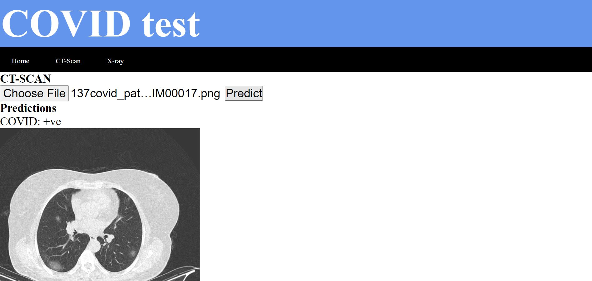
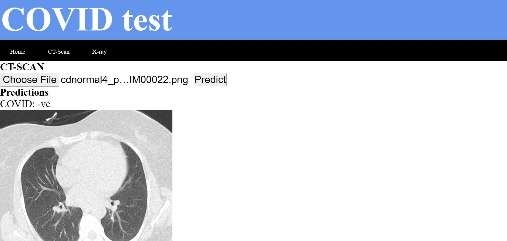
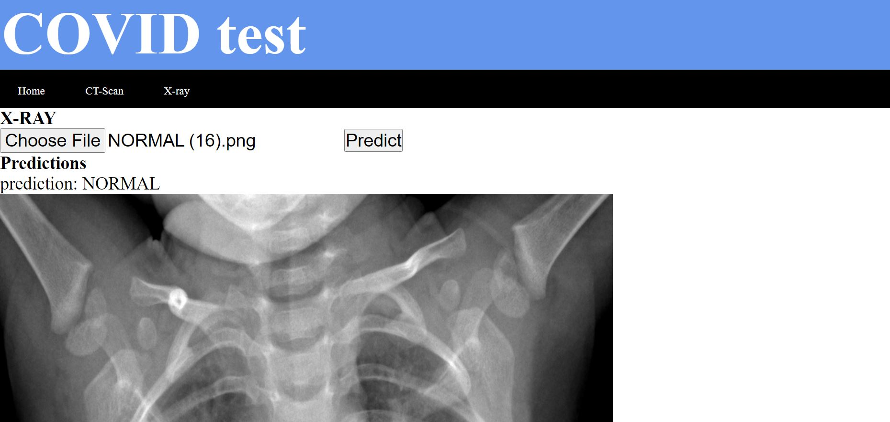
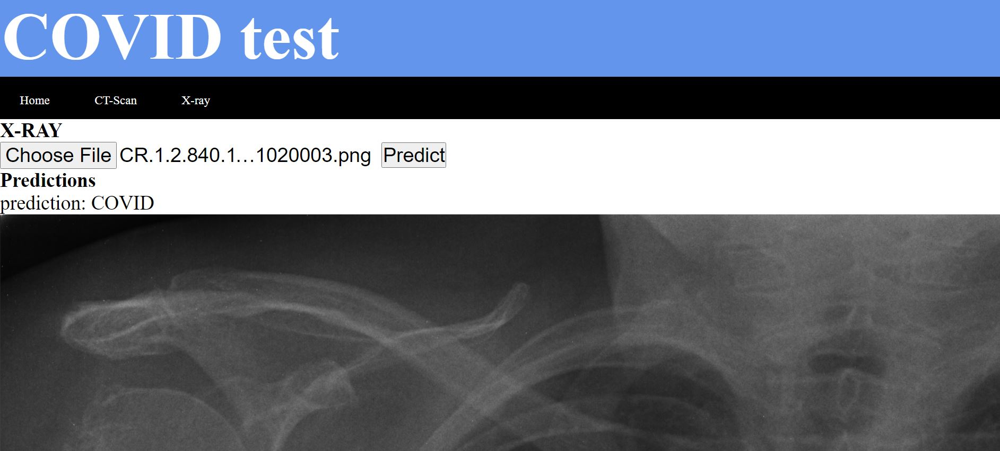
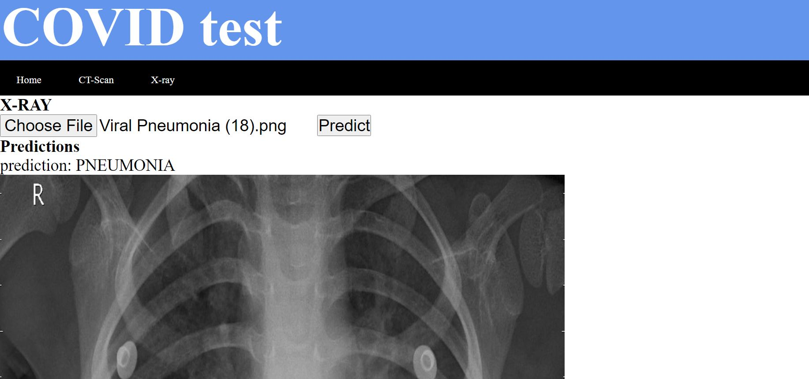

# COVID_test

A web app using deeplearning model that classifies chest CT scan and X-ray images into COVID +ve or -ve and displays the prediction.

# CT scan COVID +ve

# CT scan COVID -ve

# chest X-ray

# Normal

# COVID +ve

# Pneumonia

